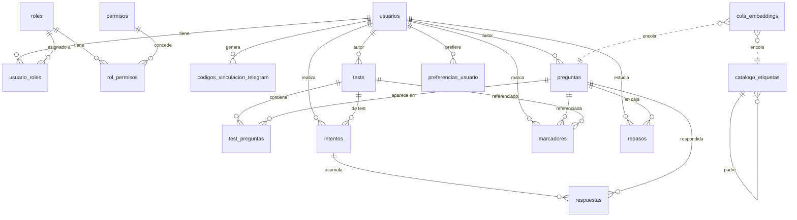

# Estado actual de la base de datos

Este documento es la referencia humana del esquema de Aprentix. El
esquema, las funciones, las políticas RLS y los datos semilla viven todos
en un único fichero:

- **`db/init/01_esquema.sql`** — SQL autoritativo. Se ejecuta al arrancar
  el contenedor de Postgres sobre una base vacía y deja el sistema listo
  para servir tráfico.

Ya no existen migraciones parciales: si necesitas cambiar el esquema,
edita `01_esquema.sql` y (si la base ya está en producción) escribe el
`ALTER`/`CREATE OR REPLACE` correspondiente contra la BBDD viva.

---

## 1. Infraestructura y roles

**Motor:** PostgreSQL 16 + pgvector (imagen `pgvector/pgvector:pg16`).

**Extensiones cargadas:**

| Extensión | Uso |
|---|---|
| `pgcrypto` | `gen_random_uuid`, `crypt`/`gen_salt` (bcrypt), `hmac` para JWT |
| `pg_trgm` | Búsqueda difusa por enunciado (`similarity`, `%>`) |
| `vector` | Embeddings 1024-dim (`BAAI/bge-m3`) + índices HNSW cosine |

**Roles Postgres:**

| Rol | Login | Uso |
|---|---|---|
| `autenticador` | ✅ | Único rol de conexión desde PostgREST. Su contraseña se fija desde la GUC `app.auth_pass`. |
| `web_anon` | ❌ | Endpoints públicos (login, registro, `leer_config`). |
| `web_user` | ❌ | Sesión autenticada; la identidad y roles funcionales llegan por JWT. |

Los roles funcionales de la aplicación (`admin`, `editor`, `alumno`) NO
son roles Postgres: viven en la tabla `roles` y se comprueban con
`tiene_permiso()` / `es_admin()` desde las políticas RLS.

**Secretos como GUCs personalizados** (inyectados por `docker-compose`
con `-c app.xxx=...`):

- `app.jwt_secret` — firma HS256 de los JWT que emite Postgres y valida PostgREST.
- `app.auth_pass` — contraseña del rol `autenticador`.
- `app.admin_pass` — contraseña inicial del usuario `admin` (solo se
  aplica en el primer init sobre BBDD vacía).

---

## 2. Diagrama entidad-relación

---

## 3. Tablas — campo a campo

### 3.1 Identidad

#### `usuarios`

| Columna | Tipo | Notas |
|---|---|---|
| `id` | `uuid` PK | Generado con `gen_random_uuid()`. |
| `username` | `text` UNIQUE NOT NULL | Login. |
| `email` | `text` UNIQUE | Opcional. |
| `chat_id` | `text` UNIQUE | ID de Telegram cuando la cuenta está vinculada. |
| `password_hash` | `text` | bcrypt (`crypt(pass, gen_salt('bf',12))`). |
| `activo` | `boolean` DEFAULT true | Un usuario inactivo no puede iniciar sesión. |
| `creado_en` | `timestamptz` DEFAULT now() | |

RLS: cada usuario solo ve su fila; los admins ven todas.

#### `roles`, `permisos`, `rol_permisos`, `usuario_roles`

Tablas clásicas de RBAC.

- `roles(id text PK, descripcion text)` — semilla: `admin`, `editor`,
  `alumno`.
- `permisos(id text PK, descripcion text)` — cadenas semánticas del
  estilo `pregunta.crear`, `test.editar`, `etiqueta.gestionar`.
- `rol_permisos(rol_id, permiso_id)` — mapping N:N.
- `usuario_roles(usuario_id, rol_id)` — un usuario puede tener varios
  roles.

Todas son legibles por `web_anon`/`web_user` (las políticas RLS las usan
via `tiene_permiso()`).

#### `codigos_vinculacion_telegram`

Códigos temporales de 6 dígitos para vincular una cuenta web con un chat
de Telegram.

| Columna | Tipo | Notas |
|---|---|---|
| `codigo` | `text` PK | Generado por `generar_codigo_telegram()`. |
| `usuario_id` | `uuid` FK → usuarios | ON DELETE CASCADE. |
| `expira_en` | `timestamptz` | 10 min por defecto; el canje limpia expirados. |

### 3.2 Contenido

#### `preguntas`

La pregunta es la entidad raíz. Los tests son colecciones ordenadas de
preguntas.

| Columna | Tipo | Notas |
|---|---|---|
| `id` | `uuid` PK | |
| `enunciado` | `text` NOT NULL | |
| `opciones` | `jsonb` NOT NULL | `[{texto: text, correcta: boolean}, ...]`. Los tests importados desde el formato viejo tienen la convención "primera = correcta"; se detecta en `importar_test_normalizado`. |
| `explicacion` | `text` | Justificación mostrada tras responder. |
| `etiquetas` | `text[]` DEFAULT `{}` | Tags libres. El auto-tagger las añade; nunca sobrescribe. |
| `embedding` | `vector(1024)` | Generado por el worker de embeddings sobre `enunciado + opción correcta`. |
| `autor_id` | `uuid` FK → usuarios | ON DELETE SET NULL. DEFAULT: `jwt_usuario_id()`. |
| `creado_en` / `actualizado_en` | `timestamptz` | `actualizado_en` se compara con `respuestas.respondida_en` para invalidar respuestas cuando la pregunta cambia. |
| `hash_contenido` | `text` GENERATED STORED UNIQUE | `md5(lower(btrim(enunciado)))`. Evita duplicar la misma pregunta al importar tests de distintas fuentes. |

Índices: HNSW cosine sobre `embedding`, GIN sobre `enunciado` (trigram) y
GIN sobre `etiquetas`.

Triggers: al INSERT y al UPDATE de `enunciado`/`opciones` se encola la
pregunta en `cola_embeddings` para que el worker la re-vectorice.

RLS:
- `SELECT`: cualquier usuario autenticado.
- `INSERT`: requiere permiso `pregunta.crear`.
- `UPDATE`: requiere permiso `pregunta.editar`.
- `DELETE`: requiere permiso `pregunta.borrar`.

#### `catalogo_etiquetas`

Catálogo semántico jerárquico de etiquetas conocidas.

| Columna | Tipo | Notas |
|---|---|---|
| `nombre` | `text` PK | Siempre en `lower(btrim(...))`. |
| `descripcion` | `text` | Texto libre que el worker usa para el embedding. |
| `palabras_clave` | `text[]` DEFAULT `{}` | El auto-tagger las busca vía `ILIKE` en enunciado y en título del test. |
| `padre` | `text` FK → catalogo_etiquetas | ON DELETE SET NULL, ON UPDATE CASCADE. Permite jerarquías (`programación ⊃ java ⊃ hibernate`). |
| `embedding` | `vector(1024)` | Del `descripcion` (calculado por el worker). |
| `creado_en` | `timestamptz` | |

Índices: HNSW cosine sobre `embedding`; btree sobre `padre`.

RLS: lectura pública; escritura requiere `etiqueta.gestionar`.

### 3.3 Tests

#### `tests`

| Columna | Tipo | Notas |
|---|---|---|
| `id` | `uuid` PK | |
| `titulo` | `text` NOT NULL | |
| `descripcion` | `text` | |
| `tipo` | `text` CHECK IN (`manual`, `simulacro`, `errores`, `mega`, `favoritos`, `tematico`) | |
| `etiquetas` | `text[]` DEFAULT `{}` | Propagadas por `clasificar_test()`. |
| `autor_id` | `uuid` FK → usuarios | DEFAULT `jwt_usuario_id()`. |
| `publico` | `boolean` DEFAULT false | Los tests migrados sin autor se marcan públicos. |
| `nota_corte`, `escala_maxima` | `numeric` | Solo `tipo='simulacro'`. |
| `creado_en` | `timestamptz` | |

Índices: GIN sobre `etiquetas`.

RLS:
- `SELECT`: `publico` o autor o admin.
- `INSERT`: permiso `test.crear`.
- `UPDATE`/`DELETE`: permiso `test.editar`/`test.borrar` o autor.

#### `test_preguntas`

Colección ordenada.

| Columna | Tipo | Notas |
|---|---|---|
| `test_id` | `uuid` FK → tests | ON DELETE CASCADE. |
| `pregunta_id` | `uuid` FK → preguntas | ON DELETE CASCADE. |
| `posicion` | `int` NOT NULL | Parte de la PK: `(test_id, posicion)`. |

RLS: lectura por autenticados; escritura por `test.editar`.

### 3.4 Actividad

#### `intentos`

Una sesión de resolución. Tras `iniciar_intento` la SPA puede
reanudarla si se corta.

| Columna | Tipo | Notas |
|---|---|---|
| `id` | `uuid` PK | |
| `usuario_id` | `uuid` FK → usuarios | ON DELETE CASCADE. DEFAULT `jwt_usuario_id()`. |
| `test_id` | `uuid` FK → tests | ON DELETE SET NULL. |
| `nombre` | `text` | Etiqueta libre (útil en fallos, favoritos). |
| `tipo` | `text` DEFAULT `'normal'` | Semánticas conocidas: `quiz`, `fallos`, `favoritos`, `simulacro`, `mega`, `tematico`, `repaso`. |
| `question_ids` | `uuid[]` | Orden congelado de preguntas; permite reanudar respetando el orden aunque se editen/borren preguntas. |
| `iniciado_en`, `finalizado_en` | `timestamptz` | `NULL` en `finalizado_en` = pendiente. |

RLS: cada usuario solo ve/edita sus intentos; admin ve todos.

#### `respuestas`

| Columna | Tipo | Notas |
|---|---|---|
| `id` | `bigserial` PK | |
| `intento_id` | `uuid` FK → intentos | ON DELETE CASCADE. |
| `pregunta_id` | `uuid` FK → preguntas | ON DELETE CASCADE. |
| `opcion_elegida` | `text` NOT NULL | Se guarda el TEXTO de la opción, no un índice, para sobrevivir a reordenaciones. |
| `correcta` | `boolean` NOT NULL | |
| `respondida_en` | `timestamptz` DEFAULT now() | Se compara con `preguntas.actualizado_en` para invalidar respuestas tras una edición. |

RLS: propagada desde `intentos` (solo tuyas o admin).

#### `marcadores`

Unifica fallos, favoritas y tests favoritos en una sola tabla.

| Columna | Tipo | Notas |
|---|---|---|
| `usuario_id` | `uuid` FK → usuarios | DEFAULT `jwt_usuario_id()`. |
| `tipo` | `text` CHECK IN (`fallo`, `favorita`, `test_favorito`) | |
| `pregunta_id` | `uuid` FK → preguntas | Obligatorio si `tipo IN ('fallo','favorita')`. |
| `test_id` | `uuid` FK → tests | Obligatorio si `tipo='test_favorito'`. |
| `contador` | `int` DEFAULT 1 | Nº de veces falladas (solo `tipo='fallo'`). |
| `actualizado_en` | `timestamptz` | |

Constraints: CHECK garantiza que solo uno de `pregunta_id`/`test_id`
esté presente según `tipo`; índice único sobre
`(usuario_id, tipo, COALESCE(pregunta_id, test_id))`.

RLS: propias o admin.

### 3.5 Embeddings

#### `cola_embeddings`

Cola de trabajo del worker Python (servicio `embeddings`). El worker
escucha `LISTEN embeddings` y procesa filas pendientes en lotes.

| Columna | Tipo | Notas |
|---|---|---|
| `id` | `bigserial` PK | |
| `entidad` | `text` CHECK IN (`pregunta`, `etiqueta`) | |
| `entidad_id` | `text` NOT NULL | UUID de la pregunta o `nombre` de la etiqueta. |
| `encolado_en` | `timestamptz` | |
| `procesado_en` | `timestamptz` | `NULL` = pendiente. |

Índice parcial: `(encolado_en) WHERE procesado_en IS NULL` para leer
solo lo pendiente.

### 3.6 Config y motor de repasos

#### `config`

Diccionario `clave → valor jsonb` para parámetros de negocio.

| clave | tipo del valor | Uso |
|---|---|---|
| `historico_2024`, `historico_2022` | `[[nota, posicion], ...]` | Baremos históricos del simulacro. |
| `plazas_referencia` | número | Plazas del año de referencia. |
| `penalizacion_fallo` | número | Fracción penalizada por respuesta incorrecta (1/3 = `0.333333`). |
| `puntos_acierto_parte_2` | número | Peso de los aciertos en la 2ª parte del simulacro. |
| `min_directa_simulacro`, `n_max_simulacro`, `e_max_simulacro` | número | Constantes de la fórmula de nota del simulacro. |
| `ritmos_repaso` | `{intensivo:[7 horas], normal:[...], relajado:[...]}` | Intervalos por caja Leitner en cada ritmo. |

RLS: lectura pública; escritura solo admin.

#### `preferencias_usuario`

Una fila por usuario con su ritmo de repaso.

| Columna | Tipo | Notas |
|---|---|---|
| `usuario_id` | `uuid` PK FK → usuarios | ON DELETE CASCADE. |
| `ritmo_repaso` | `text` CHECK IN (`intensivo`, `normal`, `relajado`) | DEFAULT `normal`. |
| `actualizado_en` | `timestamptz` | |

RLS: cada usuario solo la suya.

#### `repasos`

Estado del motor Leitner por (usuario, pregunta). Guardamos solo
`caja` y `ultima_en`; la fecha del próximo repaso se DERIVA al vuelo
como `ultima_en + intervalo_repaso(caja, ritmo_del_usuario)`. Así,
cambiar el ritmo NO requiere UPDATE masivo y no hay riesgo de
desincronización.

| Columna | Tipo | Notas |
|---|---|---|
| `usuario_id` | `uuid` FK → usuarios | Parte de la PK. DEFAULT `jwt_usuario_id()`. |
| `pregunta_id` | `uuid` FK → preguntas | Parte de la PK. |
| `caja` | `int` CHECK BETWEEN 1 AND 7 | DEFAULT 1. Un acierto sube 1, un fallo baja 2 (con suelo 1). |
| `aciertos`, `fallos` | `int` DEFAULT 0 | Contadores acumulados. |
| `ultima_en` | `timestamptz` DEFAULT now() | Anclaje temporal. En caso de fallo se ancla a `now() - intervalo(caja, ritmo)` para que la fecha derivada caiga en `now()` (vencida al instante). |

Índice: `(usuario_id, ultima_en)`.
RLS: cada usuario solo las suyas.

---

## 4. Funciones (RPCs expuestas por PostgREST)

Salvo indicación explícita, se llaman como `POST /rpc/<nombre>` y
requieren un JWT válido (rol `web_user`). Las que aceptan `web_anon` se
usan sin token (login, registro, `leer_config`).

### 4.1 Firma JWT y helpers RBAC

Auxiliares invisibles al cliente pero clave para el resto del sistema.

- **`url_b64(bytea) → text`** — base64 URL-safe sin padding.
- **`firmar_jwt(payload jsonb, secret text) → text`** — HS256 sobre
  pgcrypto. Compatible con la verificación por defecto de PostgREST.
- **`jwt_usuario_id() → uuid`** — extrae `sub` del claim.
- **`jwt_roles() → text[]`** — extrae `roles` del claim.
- **`tiene_permiso(p text) → boolean`** — comprueba si alguno de los
  roles del JWT tiene el permiso `p` en `rol_permisos`.
- **`es_admin() → boolean`** — `'admin' = ANY(jwt_roles())`.

### 4.2 Auth (accesible a `web_anon`)

- **`registrarse(username, password, email?) → uuid`** — crea usuario
  con rol `alumno`. Valida longitud mínima.
- **`iniciar_sesion(username, password) → text`** — devuelve un JWT
  firmado (12h de expiración).
- **`login_web(username, password) → jsonb`** — envuelve
  `iniciar_sesion` y devuelve `{token, user_id, username, roles,
  puede_gestionar}` para el frontend.
- **`registrar_web(username, password, email?, chat_id?) → jsonb`** —
  registrarse + `login_web` en un viaje. Vincula chat_id si viene.
- **`generar_codigo_telegram() → text`** — código de 6 dígitos que
  expira a los 10 min.
- **`canjear_codigo_telegram(codigo, chat_id) → uuid`** — vincula el
  chat de Telegram al usuario dueño del código.

### 4.3 Sesión y progreso

- **`mi_sesion() → jsonb`** — `{user_id, username, roles,
  puede_gestionar}` del usuario del token.
- **`mi_progreso() → jsonb`** — respondidas hoy, nota media, nº
  falladas, nº favoritas, total respondidas.
- **`mi_progreso_detallado() → jsonb`** — igual que `mi_progreso` +
  desglose por test.

### 4.4 Listado y ejecución de tests

- **`listar_tests(solo_favoritos, page, size, etiqueta?, solo_pendientes,
  orden) → jsonb`** — página de tests con conteos, favorito, y flags de
  intento pendiente. `orden`: `reciente` (default), `antiguo`,
  `intentos_desc`, `intentos_asc`.
- **`obtener_preguntas_test(test_id) → jsonb`** — `{quiz:{id,title},
  questions:[{id,text,options[{text,isCorrect}],explicacion,etiquetas}]}`.
- **`iniciar_intento(test_id?, tipo, nombre?, question_ids) → jsonb`** —
  crea `intentos` y devuelve `{attempt_id}`.
- **`registrar_respuesta(intento_id, pregunta_id, texto, correcta,
  adelantada=false) → void`** — inserta en `respuestas`, mantiene el
  marcador `fallo` y mueve la caja Leitner. Si `adelantada=true`, el
  acierto no cambia caja ni `ultima_en` (evita farmear cajas).
- **`finalizar_intento(intento_id) → void`** — pone `finalizado_en=now()`.
- **`descartar_intento(intento_id) → void`** — borra el intento.
- **`intento_pendiente(tipo, test_id?) → jsonb`** — devuelve el último
  intento no finalizado con contadores para el diálogo de reanudación
  (respondidas, pendientes, invalidas).
- **`reanudar_intento(intento_id) → jsonb`** — limpia respuestas y
  marcadores invalidados por ediciones, devuelve pendientes en orden y
  acumulados válidos.
- **`borrar_test_y_preguntas(test_id, borrar_preguntas=false) → jsonb`** —
  borra el test; opcionalmente borra las preguntas exclusivas de ese
  test (las compartidas se conservan). Devuelve `{test_id,
  preguntas_borradas, preguntas_compartidas}`.

### 4.5 Marcadores (fallos y favoritas)

- **`toggle_favorita_pregunta(pregunta_id) → jsonb`** — alterna `{favorito}`.
- **`toggle_favorita_test(test_id) → jsonb`** — idem para tests.
- **`mis_favoritas_ids() → jsonb`** — `{question_ids: [...]}` para
  reconstruir el estado favorito en el cliente sin traer todo el detalle.
- **`mis_favoritas() → jsonb`** — listado completo con opciones,
  explicación y etiquetas.
- **`mis_favoritas_agrupadas() → jsonb`** — igual pero incluye
  `quiz_title` (primer test en el que aparece).
- **`mis_fallos() → jsonb`** — listado de falladas con contador
  `veces_fallada`.

### 4.6 Importar / exportar

- **`importar_test(titulo, json) → uuid`** — importa el formato "nuevo"
  (`opciones: [{texto, correcta}, ...]`). Deduplica preguntas por
  `hash_contenido`. Requiere permiso `test.crear`.
- **`importar_test_normalizado(titulo, descripcion, preguntas) → uuid`** —
  acepta también el formato viejo (opciones como array de strings con
  convención "primera correcta") y lo normaliza.
- **`descargar_test(test_id) → jsonb`** — vuelca el test como JSON
  autocontenido.
- **`descargar_todos_los_tests() → jsonb`** — array de dumps para
  todos los tests que el usuario puede ver.

### 4.7 Mega, simulacro y temáticos

- **`preguntas_de_tests(test_ids[]) → jsonb`** — todas las preguntas
  únicas de un conjunto de tests, con `quiz_title`.
- **`crear_mega_test(titulo, test_ids[]) → uuid`** — persiste el
  agregado como test tipo `mega`.
- **`listar_simulacros() → jsonb`** — tests con `tipo='simulacro'` y su
  nota de corte.
- **`crear_simulacro(titulo, test_id, nota_corte, escala_maxima) → uuid`** —
  marca un test como simulacro con los baremos indicados.
- **`generar_test_tematico(etiqueta, n=20) → uuid`** — test aleatorio
  de una etiqueta.
- **`crear_test_tematico_multi(etiquetas[], n=20, titulo?) → uuid`** —
  variante multi-etiqueta con **expansión jerárquica**
  (`etiqueta_y_descendientes`) y priorización de preguntas menos vistas
  por el usuario.

### 4.8 Etiquetas y auto-tagger

- **`etiqueta_y_descendientes(nombre) → text[]`** — recursivo sobre
  `catalogo_etiquetas.padre`. Devuelve `{p_nombre}` si no existe (para
  no romper búsquedas por etiqueta libre).
- **`listar_etiquetas() → jsonb`** — con `padre`, `num_hijas`,
  `num_preguntas`, `num_tests`, `palabras_clave`, `vectorizada`.
- **`crear_etiqueta(nombre, descripcion, palabras_clave=[], padre?) → jsonb`** —
  normaliza nombre a `lower(btrim)`. Valida ciclos y existencia del
  padre.
- **`borrar_etiqueta(nombre) → void`** — la elimina y la quita del
  array `etiquetas` de todas las preguntas.
- **`clasificar_test(test_id) → text[]`** — mira título y descripción
  contra el catálogo, añade etiquetas al test y las propaga a todas
  sus preguntas.
- **`reclasificar_pregunta(id, k=5, umbral=0.55, knn_k=5, knn_umbral=0.70,
  knn_min=1) → int`** — auto-tagger híbrido:
  - **(a)** similitud coseno del embedding contra el catálogo.
  - **(b)** `ILIKE` de las palabras_clave del catálogo en el enunciado.
  - **(c)** `ILIKE` del nombre de la etiqueta en el enunciado.
  - **(d)** `ILIKE` del nombre/palabras_clave en el título del test
    asociado (etiqueta transitiva).
  - **(e)** etiquetas de las `knn_k` preguntas más parecidas por
    embedding (**bucle de mejora**: lo que etiquetas a mano educa
    al clasificador).

  Conservador: **solo añade**, nunca elimina.
- **`reclasificar_todas() → int`** — recorre todas las preguntas con
  embedding.
- **`reclasificar_todo() → jsonb`** — clasifica primero todos los
  tests y luego todas las preguntas.
- **`buscar_preguntas(q, lim=20, etiqueta?) → TABLE`** — trigram sobre
  el enunciado con filtro opcional por etiqueta expandida.
- **`buscar_preguntas_multi(q, lim=40, etiquetas[]?) → TABLE`** —
  variante con array de etiquetas (OR).

### 4.9 Estado de embeddings

- **`estado_embeddings() → jsonb`** — contadores del worker (totales,
  vectorizadas, cola pendiente).
- **`encolar_revectorizado_total() → int`** — reencola TODAS las
  preguntas; útil tras cambiar de modelo. Requiere `etiqueta.gestionar`.

### 4.10 Repasos (Leitner)

- **`ritmo_repaso_usuario(usuario_id) → text`** — lee de
  `preferencias_usuario`, fallback a `'normal'`.
- **`intervalo_repaso(caja, ritmo) → interval`** — devuelve el
  `interval` correspondiente en `config('ritmos_repaso')`.
- **`mi_ritmo_repaso() → jsonb`** — `{ritmo, curvas}`.
- **`set_ritmo_repaso(ritmo) → jsonb`** — solo actualiza
  `preferencias_usuario`. Como la fecha del próximo repaso se deriva al
  vuelo, no hay UPDATE masivo.
- **`resumen_repaso_test(test_id) → jsonb`** — `{total_repasos, vencidas,
  dominadas, siguiente, test_realizado}`.
- **`resumen_repaso_global() → jsonb`** — mismo formato pero sobre
  todos los tests que el usuario ha realizado al menos una vez.
- **`preguntas_repaso_test(test_id, n=20, adelantar=false) → jsonb`** —
  devuelve preguntas vencidas (o próximas si `adelantar=true`), con
  `caja` incluida en cada objeto.
- **`preguntas_repaso_global(n=20, adelantar=false) → jsonb`** — idem
  cross-test.

### 4.11 Admin

Todas requieren `es_admin()` en el JWT. Son `SECURITY DEFINER` para
poder escribir en tablas donde el rol `web_user` no tendría permiso
directo salvo por RLS.

- **`listar_usuarios() → jsonb`** — todos los usuarios con sus roles.
- **`listar_roles() → jsonb`** — catálogo de roles con descripción.
- **`asignar_rol(usuario_id, rol_id) → void`** — idempotente.
- **`quitar_rol(usuario_id, rol_id) → void`** — se protege contra
  quedarse sin ningún admin.
- **`resetear_contrasena(usuario_id, nueva_pass) → void`** — valida
  longitud mínima 6.
- **`set_usuario_activo(usuario_id, activo) → void`** — soft-disable.

### 4.12 Config

- **`leer_config() → jsonb`** — objeto plano con todo `config`.
  Accesible a `web_anon` y `web_user`.

---

## 5. Row Level Security

Se aplica RLS a: `usuarios`, `intentos`, `respuestas`, `marcadores`,
`preguntas`, `tests`, `test_preguntas`, `catalogo_etiquetas`, `config`,
`preferencias_usuario`, `repasos`.

Ideas generales:

- **Usuario propio:** el usuario solo ve/modifica sus propios
  intentos, respuestas, marcadores, repasos y preferencias.
- **Admin:** ve todo, modifica casi todo (a través de las políticas
  `*_admin_all` o `es_admin()` en `USING`/`WITH CHECK`).
- **Preguntas y tests:** lectura para autenticados; escritura por
  permiso (`pregunta.*`, `test.*`). Los tests además exponen los
  `publico=true` a cualquier autenticado y respetan la autoría.
- **`test_preguntas`:** lectura libre para autenticados, escritura por
  permiso `test.editar`.
- **`catalogo_etiquetas`:** lectura pública, escritura por permiso
  `etiqueta.gestionar`.
- **`config`:** lectura pública, escritura solo admin.

Las políticas usan `jwt_usuario_id()`, `tiene_permiso()` y
`es_admin()`, definidos como `SECURITY DEFINER` para poder leer
`rol_permisos` sin requerir GRANTs adicionales al `web_user`.

---

## 6. Triggers y eventos

### 6.1 Encolado automático de embeddings

Los triggers `preguntas_emb_ai/au` y `catalogo_etiquetas_emb_ai/au`
insertan en `cola_embeddings` y disparan `NOTIFY embeddings` con el ID
concreto. El worker en Python (`embeddings/`) escucha el canal y
procesa en lotes.

- Sobre `preguntas`: se re-vectoriza si cambia `enunciado` u `opciones`
  (el worker calcula el embedding sobre `enunciado + opción correcta`).
- Sobre `catalogo_etiquetas`: se re-vectoriza si cambia `descripcion` o
  `nombre`.

### 6.2 DEFAULTs dependientes de JWT

`intentos.usuario_id`, `marcadores.usuario_id`, `repasos.usuario_id`,
`preguntas.autor_id` y `tests.autor_id` tienen como DEFAULT
`jwt_usuario_id()`, para que el frontend no tenga que enviar su propio
ID en los INSERTs.

---

## 7. Curvas de repaso Leitner

Los intervalos entre repasos por caja se leen de
`config('ritmos_repaso')`, en horas:

| Caja | Intensivo | Normal | Relajado |
|:-:|:-:|:-:|:-:|
| 1 | 2 h | 24 h (1 d) | 48 h (2 d) |
| 2 | 8 h | 72 h (3 d) | 168 h (7 d) |
| 3 | 24 h (1 d) | 168 h (7 d) | 504 h (21 d) |
| 4 | 72 h (3 d) | 360 h (15 d) | 1080 h (45 d) |
| 5 | 168 h (7 d) | 720 h (30 d) | 2160 h (90 d) |
| 6 | 360 h (15 d) | 1440 h (60 d) | 4320 h (180 d) |
| 7 | 720 h (30 d) | 2880 h (120 d) | 8760 h (365 d) |

Regla del motor:

- Acierto normal → sube una caja (techo 7), `ultima_en = now()`.
- Acierto adelantado → no cambia caja ni `ultima_en`, solo `aciertos++`.
- Fallo → baja dos cajas (suelo 1); `ultima_en = now() - intervalo(caja, ritmo)`
  para que la fecha derivada caiga en `now()` (vencida al instante).

La fecha de próximo repaso se calcula al vuelo:
`proximo_repaso = ultima_en + intervalo_repaso(caja, ritmo)`.
